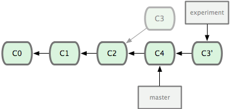

# Be kind to the people you work with

So, you are all comfy at your couch, the beer is cold, you are starving but you are waiting for the film to start before having a go at the pizza. You turn on the [vcr](http://en.wikipedia.org/wiki/Videocassette_recorder), put the [tape](http://en.wikipedia.org/wiki/VHS) in and press play, only to find out that the tape has reached the end. Wouldn't it be awesome if the person that watched it before you had rewinded? Wouldn't it be awesome if the person that picks the last tissue replaces the toilet paper? Imagine if we all pressed the toothpaste only from the end up.

It is these simple things in life that make everybody happy. You can make the people you work with happy by tidying up after yourself and git lets you do this really easy. What follows is some very simple techniques to make sure you achieve an awesome git workflow.


## Table of Contents

* [An introduction](#an-introduction)
  * setup, global variables, colors, editor, github config, ssh values (linux), prefer ssh cloning
* [Branching out](#branching-out)
  * references, hashes, HEAD, ~/^ difference
* [Commit messages](#commit-messages)
  * title, description (bullet points, code explanation if needed), 80 char limit, # in editor, no '.' in title
* [Commit often, push once](#commit-often-push-once)
  * try to squash commits for whole feature, or many commits under the same concept
* [Avoiding merge commits](#avoiding-merge-commits)
  * pull --rebase, when can you use it?
* [Cherry picking](#cherry-picking)
  * also for ranges
* [Tagging](#tagging)
* [Stashing](#stashing)
* [Debugging](#debugging)
* [Frequently used commands](#frequently-used-commands)
  * git branch -r, log .., show
* [Shortcuts](#shortcuts)
  * aliases
* [Git flow](#git-flow)
* [Resources](#resources)

## An introduction

This isn't a proper introduction. This [book](http://git-scm.com/book) has one though, and I think that chapters 1-3 are required reading. Most of the things written here come from that books, or various articles in the wild.

Before you are ready to start working, it is essential that you have git well set up. There are two ways you can tell git about you and your preferences. 

The first is the `/etc/gitconfig` file. You can override settings in a separate `~/.gitconfig` file, which is the next place git will look for configuration. Lastly, git will look at project specific `.git/config` files which will in turn override all the rest.

You can also set configuration through the `git config` command. Use 

`$ git config -h` 

to see all the available options.

First of all, you should introduce yourself to everybody and start taking responsibility for your code. You do this with

```
$ git config --global user.name "John Doe"
$ git config --global user.email johndoe@example.com
```
You are going to be writing a lot of comments explaining your changes so it's nice to use an editor you are comfortable with

```
$ git config --global core.editor emacs
```
This works with GUI editors too, like Sublime Text.

Since you will be looking at a terminal most of the time, it makes some sense to have git use colored output. You can look at the `color.*` configuration options. You'll most likely want to leave this setting to `auto`, so that git colors all output directed to the terminal.

```
$ git config --global color.ui auto
```

## Branching out
TODO

## Commit messages

Communicating your changes to the rest of the team is crucial. At any given time, you want every member to have an idea of what is going on to the project. The business rules for a new feature. A new css mixin you just pushed. Some addition to a library that might break somebody's changes. As much self explaining as your code may be it takes longer for someone to understand what's going on and track all changes individually than providing a simple description and explanation of the changes. It also speeds the reviewing process a lot. The reader can quickly grasp what's going on.

Structure your commit message like this:

```
Short (80 chars or less) summary of changes

More detailed explanatory text, if necessary.  Wrap it to about 80
characters or so.  In some contexts, the first line is treated as the
subject of an email and the rest of the text as the body.  The blank
line separating the summary from the body is critical (unless you omit
the body entirely); tools like rebase can get confused if you run the
two together.

Further paragraphs come after blank lines.

 - Bullet points are okay, too

 - Typically a hyphen or asterisk is used for the bullet, preceded by a
   single space, with blank lines in between, but conventions vary here
```

Do not assume that the reader understands the original problem or knows the context, even if it is obvious. New members come to the team and what makes sense today can be easily forgotten in the future. Reference the issue in the commit title (TODO). It helps when you want to find all the code changes related to a specific feature.

Refrain from trying to reproduce the feature description or specs in the commit message. Just try to describe your changes and the rationale behind them in simple English. Take your time when commiting, read your message out loud so that you know it makes sense.

## Commit often, push once
 
Consider git as a more powerful undo command. You can keep track of all your changes and revert to a previous state easily. You should commit often, so you have more control in what changes you pick and how many steps back a revert will get you at.

Many times you start making changes and at some point you introduce a really nasty bug that breaks everything. Since you don't know the cause of the problem, you should allow yourself to feel secure by having a stable state you can always revert to. So, break down what needs to be done in small tasks. Every time you finish a task, commit. Don't introduce large scale change in one go.

Other times you work on a problem but the solution is not obvious. You start playing around with stuff to see how they respond. This state of prototyping can introduce errors. It's good to have sequential progress that you can revert to.

Be careful when you publish to the remote repo. Once you push something upstream you cannot take it back. You can always correct things with additional commits, but by spending time organizing your work your commits are more coherent and consistent. The reviewer is able to go through the changes only once. Nobody likes looking at this log output

```
* 63bb2f3 - Completed payments feature
* 6c7aa9d - Changes in CSS for payments
```

Before you push you can rebase locally and use the squash option to combine commits into one. Suppose you have the above commits. You can do a 

```
$ git rebase -i HEAD~2
```

and you'll be presented with instructions in your editor on how to proceed.

```
pick 63bb2f3 - Completed payments feature
pick 6c7aa9d - Changes in CSS for payments
# Rebase 6c7aa9d..63bb2f3 onto 63bb2f3
#
# Commands:
#  p, pick = use commit
#  r, reword = use commit, but edit the commit message
#  e, edit = use commit, but stop for amending
#  s, squash = use commit, but meld into previous commit
#  f, fixup = like "squash", but discard this commit's log message
#  x, exec = run command (the rest of the line) using shell
#
# These lines can be re-ordered; they are executed from top to bottom.
#
# If you remove a line here THAT COMMIT WILL BE LOST.
#
# However, if you remove everything, the rebase will be aborted.
#
# Note that empty commits are commented out

```

In order to squash, you `pick` the first commit and then you change the `pick` text with `squash` or `s` for the commits you want to squash into the first. You can also edit the _single_ commit message and when you save, git will rewrite history by finding the common ancestors of the commits, applying the diff and assigning a new commit hash to the patch. For as long as you rebase your `HEAD` is in a detached state. The situation is better explained in the following images



All that's left to be done is a fast-forward in the master branch


In case there are conflicts you can resolve them and then do a 
```
$ git rebase --cont
```
In the event that something goes wrong you can go back to the original `HEAD` by doing
```
$ git rebase --abort
```

__Remember:__ Only squash commits that are in your local repository and have not been published yet.

## Avoiding merge commits

Merge commits are not necessarily bad. Sometimes you want it to be clear that there was a branch was merged into another. For example, we want to know when we merge to the staging or production branches. For most situation though, you generally want to avoid merge commits because they clatter the log and get in the way of the commits that really matter. There are two situations when you would want to avoid the merge commit and this can be achieved with rebasing.

The first situation is when you are working on a branch, finished your work and are ready to push it to the remote repo. There may be a case when somebody else has pushed code before you. If you pull the changes, they will be merged into your repository. The status then will be that you are at least two commits ahead of the remote branch. One of those commits is the merge commit. The tool that you can use to avoid this is to do a 
```
$ git pull --rebase
```
What git does is that it fetches the changes from the remote, figures out the diff, applies it, and then applies your commits on top. History will write that your changes where made afterwards.

In case of conflicts, git will ask you to resolve them (just as it would do with a merge). Make sure you don't delete the conflicting files in the commit comment and then tell git to continue with the rebasing. No merge commit there. Yay!

The other situation is when you have made changes to different branches and you want to apply them all. 


What you want to do is
```
$ git checkout experiment
$ git rebase master
First, rewinding head to replay your work on top of it...
Applying: added staged command
```

This is the simplest rebase scenario, and possibly the most common you will encounter. For more details on rebasing, you can look at the [rebasing chapter](http://git-scm.com/book/en/Git-Branching-Rebasing) in the ProGit book.

__Remember:__ You should not rebase commits that have already been pushed into remote branches. Unless you are sure nobody else has pulled your code (which is probably impossible) in which case you have to force-push your changes upstream.

## Debugging

You can use git to help you track down when and where a bug was introduced in the codebase. The tools that you use are `git blame` and `git bisect`.

### blame

If you issue a 
```
$ git blame -L 1,10 afile
```
git will present the file `afile` with annotations in each line. These annotations show when was the last time each line was changed, the commit hash and the name of the person who made the change. You can limit the output to lines 1-10 with the `-L` switch. Another cool feature is the `-C` switch; git will even show the original file that sections of the code came from.

### bisect

There are sometimes where a regression bug gets introduced in the codebase and nobody notices till later on. Before starting the bug hunt, the first thing you should do is write a test that reproduces it. If you don't know where to look for, git can perform a binary search in the codebase history to help you find which commit introduced the bug. 

You set the process off with `git bisect off` and then you run `git bisect bad` to tell git that the current commit you are on is problematic. Then you have to tell git the last known good state of your codebase with `git bisect good [good_commit_hash]`. If you are totally uncertain about which the last good state was you should fall back to the last release. Don't worry if it feels you're going way back. Git is fast.
```
$ git bisect start
$ git bisect bad
$ git bisect good v1.0
Bisecting: 6 revisions left to test after this
[ecb6e1bc347ccecc5f9350d878ce677feb13d3b2] error handling on repo
```
Git found out there are 12 commits between the latest and the commit tagged with v1.0 and checked out the middle one. Your `HEAD` will now be in a detached state, but you should run your test to see if it still fails. If it passes, you should look further. You tell git that everything's good with `git bisect good` and you continue the search.
```
$ git bisect good
Bisecting: 3 revisions left to test after this
[b047b02ea83310a70fd603dc8cd7a6cd13d15c04] secure this thing
```
You run your test again and you are lucky. The test fails, so you know that the bug was introduced in this commit. You inform git with `git bisect bad` and once you have all the required information you issue a
```
$ git bisect reset
```
to return your `HEAD` to the latest state. Now you know where to look for the bug, so let's get it fixed :).

## Git flow

This section provides an overview of a sample workflow when working with teams. It is based on [GitFlow](https://datasift.github.io/gitflow/IntroducingGitFlow.html) with small changes in the details. The main idea is that all work should be made in separate feature branches. 

__Rule no. 1__: There is a long-lived branch which should be deployable at any given time.

__Rule no. 2__: Only feature branches and hotfixes can be merged in the long-lived branch.

### The goal

Chances are that in your organization you have people that request things, people that implement them and people that test the implementation and either accept or reject it. Most of the times people have distinct roles in Product and Engineering teams, but this need not always be the case.

The path is always the same though; `feature -> implementation -> approval -> release`. Yeah, right, in a perfect world it might be this way. Reality is often harsh. An implementation gets rejected at the last minute and needs to be reworked, or it is decided that we don't want a feature any more and it should not be released. That's why you can always be prepared if you keep work isolated from the rest of the code base until the final approval.

### The long-lived branch

To begin with, your project should have a long lived branch. This branch is usually called `master`. The long lived branch is the one that gets released to production. Every time you need to work on something (feature, bug, tech debt) you create a new branch based on `master`. This way you can make sure that your work is based on production code. It also gives you the chance to keep your work isolated. 

Once you finish your work you need to publish it so it can get approval. You could merge the feature branch in the `master` branch, but that would violate Rule no. 1 above. Hopefully there is an environment where you can upload things for testing without caring if it breaks or not. Most people call this the "staging" environment. You could potentially deploy your feature branch on the staging environment and ask somebody to test it. But what if there are a lot of people who want their implementations tested? We would have to block the whole pipeline until each feature is tested sequentially.

### The staging branch

This is where a second long-lived branch comes into play, usually called `staging`. This branch serves the purpose of accumulating all changes that need to be tested before a release. It allows testers to work in parallel. Another benefit is that it allows for quick merges, thus reducing regression bugs or conflicts with other feature work.

The `staging` branch acts as a bucket of changes. We shouldn't be too concerned about this branch's history or well being. It could be destroyed at any time or rebuilt. Its history could be rewritten. Some people with a more strict release schedule (say one release every week) prefer to have short-lived release branches for this purpose. No matter how you do this, there is one important thing to keep in mind. Feature branches can be merged in the release/staging branch, but all feature pull requests should be against the `master` branch. This way, if we decide that we don't want to release a feature after all, or a feature got rejected at the last minute and we want to exclude it from the release, we can still release all accepted features by merging their respective pull requests to master.

The `staging` branch can be rebased frequently on `master`, so it's as close to production code as possible at all times.

### Hotfixes

Hotfixes can benefit greatly from the above. You can quickly branch off master, deploy your hotfix branch to the staging environment, get approval, merge into master and deploy. You can then safely restore staging back to its original state by just deploying the `staging` branch. You should merge your hotfix branch on `staging` too.

### Bigger changes

Sometimes there is a big release coming up, or you need to split your work in more tasks, with each task depending on the previous one. A solution to this would be to create a bigger feature branch, or a release branch. Each one of the small tasks should be targeted against the release branch, allowing you to integrate your changes often. This "small" release branch can then be treated as a regular feature branch, no matter how many tasks it touches upon.
